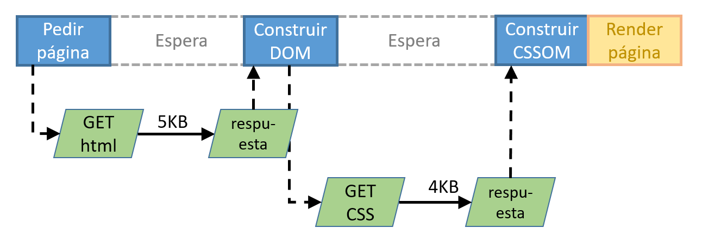

# Critical Render Path (CRP
El camino crítico de renderizado es el conjunto de tareas que realiza el navegador desde que se realiza la solicitud del html de una página, hasta que esta es renderizada (convertida a pixels). En este camino crítico intervienen los scripts y css que haya en la página bien inline o referenciados en archios externos (que se deberán descargar también).


Los conceptos de todo esto se pueden estudiar e esta parte de la documentación de Google Developers:
[Critical Rendering Path](https://developers.google.com/web/fundamentals/performance/critical-rendering-path/)
y en el curso gratuito de Udacity del mismo autor:
[Curso Website Performance Optimization](https://www.udacity.com/course/website-performance-optimization--ud884).
## CRP e imagenes
Las imágenes no bloquean el camino crítico de renderizado. Por lo que si una página no tubiera scripts ni CSS, tras la recepción del HTML ya se podría construir el DOM y realizar el renderizado. Por lo tanto el CRP tendría solamente 1 paso.

## CRP y hojas de estilo
En el siguiente diagrama se muestra como el navegador solicita el HTML de la página, entonces empieza a construir el DOM a partir de dicho HTML y al encontrar un enlace a una hoja de estilo, se realiza su petición. Al recibirse el CSS, se inicia la construcción del CSSOM y una vez terminado se inicia la renderización.



El navegador descarga todas los archivos de estilos apuntados por etiquetas <link>, pero solamente son bloqueantes para el renderizado que no tenga atributo *media* o los que lo tengan y su evaluación sea #true#.
```css
    <link rel="stylesheet" href="estios1.css" />
    <link rel="stylesheet" href="estios1.css" media="screen and min-width=450px"/>
    <link rel="stylesheet" href="estios1.css" media="print"/>
```
En este ejemplo, si el ancho del viewport es de 500px, aunque se descargan todas las hojas de estilo, solamente bloquean el renderizado las dos primeras. Por el contrario, si el ancho del viewport fuera 400px, entonces solamente la primera bloquearía el renderizado.

## CRP y JavaScript
Si el navegador encuentra JavaScript en su lectura del HTML, detiene su construcción del DOM, ejecuta el JS y luego continua con la construcción del DOM.


Si el JavaScript está incluido en línea (dentro de la etiqueta \<script>), se ejecuta inmediatamente y el proceso puede ser relativamente rápido. Pero si el JavaScript está siendo referenciado por el atributo *src* de la etiqueta \<script>, entonces se debe descargar el archivo con el código para poder ejecutarlo y luego seguir construyendo el DOM.


> *Las etiquetas \<script src="">, por defecto, impactan directamente en el CRP.*

Los scripts que no modifican ni el DOM ni los estilos iniciales deberían ser cargados en diferido para sacar su carga del CRP.

La atributo **async** de la etiqueta \<script src=""> indica al navegador que haga la petición de ese script en paralelo y que su descarga no bloquee el parseo y construcción del DOM. Cuando la descarga haya terminado, entonces sí se detendrá la construcción del DOM y se ejecutará el contenido del JS descargado. Este atributo no garantiza el orden en el que se ejecutarán los scripts.


El atributo **defer** en la etiqueta \<script src=""> implia que el sdript se descarga en paralelo y que no se descargue hasta que no se haya construido. Este atributo garantiza que todos los defer se ejecutan en el orden que se han insertado den el documento.


Por lo tanto el proceso de decisión debería ser el siguiente:


Fuente de imagenes: [somostechies.com](https://somostechies.com/async-vs-defer/).

## Precarga y preconexión de JS y CSS
El la cabecera del documento HTML, se puede indicar mediante enlaces link que precargue hojas de estilo, scripts y fuentes.

```html
    <link rel="preload" as="script" href="super-important.js" />
    <link rel="preload" as="style" href="critical.css" />
    <link rel="preload" as="font" crossorigin="crossorigin" type="font/woff2" href="myfont.woff2" />
```
## Prefetching de recursos de la siguiente página

Una vez cargada una página, se pueden cargar los recursos (incluso el propio html) de la siguiente mediante links de tipo prefetch.

```html
    <link rel="prefetch" href="/images/big.jpeg"/>
    <link rel="next" href="2.html"/>
```

## Carga asíncrona de CSS (mitad inferior de la página)

```html
    <link rel="preload" href="path/to/mystylesheet.css" as="style" onload="this.onload=null;this.rel='stylesheet'" />
```

[Volver al índice de temas](../../README.md)
