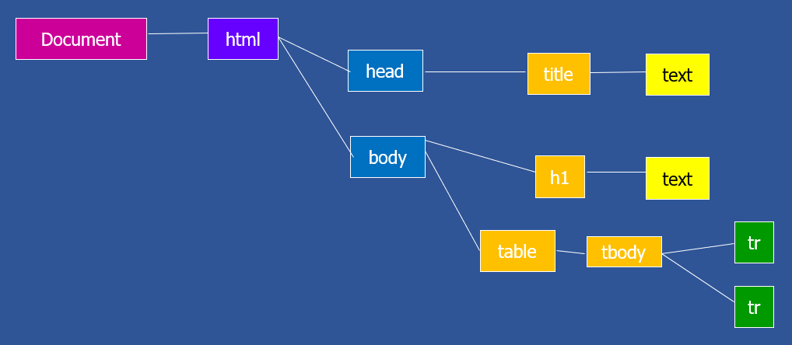

# DOM (Document Obejct Model)

**DOM** es una especificación de la **W3C** que indica como debe ser la representación jerárquica de un documento XML.
DOM define una serie de interfaces con métodos que se llaman igual en todos lo lenguajes de programación.



La carga de un documento HTML en un navegador, de forma simplificada, consiste en un proceso de análisis de las etiquetas HTML de dicho documento y su traducción (renderizado) a pixeles dentro del área de visulización (View Port) del navegador.

Como consecuencia del análisis de las etiquetas HTML del documento, el navegador crea, en memoria, una estructura de objetos anidados que tiene forma de árbol (es decir cada objeto puede tener cero, uno o más hijos) que representan los elementos que se mostrarán en el área de visualización (View Port). A esa estructura de objetos se le denomina D.O.M o **DOM** que son las siglas de ***Document Obejct Model***.

El DOM mantiene en todo momento la estructura de objetos que son visualizados en el navegador. En un primer momento el DOM tiene la estructura resultante de analizar el documento HTML recibido del servidor, pero posteriormente, mediante JavaScript se puede modificar el DOM y como consecuencia lo que visualiza (renderiza) en navegador.

## Objeto document
Todo script JavaScript ejecutado en un navegador tiene acceso a la variable de ambito global **document**. Esta variable es el punto de acceso para lectura y modificación del DOM.

## Eventos del DOM
Los eventos permiten detectar circunstancias acontecidas en el navegador cómo la carga del documento, acciones de ratón o de teclado iniciadas por el usuario. Desde JavaScript, se pueden detectar estos eventos e indicar qué tareas se deben ejecutar cuando estos eventos se produzcan. Para ello, a cada elemento se le pueden asignar una o varias funciones (handlers o manejadores) que se ejecutarán asociadas a un evento.

Para asociar un handler a un elemento, además de una referencia al elemeno, se debe indicar el tipo de evento al cual asociar la función de respuesta al evento (handler).

Por ejemplo para detectar en qué momento el documento HTML ha sido cargado y parseado, estándo ya el DOM disponible, se dispone del evento de tipo ***DOMContentLoaded*** del objeto ***document***. Para asignar un evento a un elemento del DOM se emplea el método addEventListener:

```javascript
    document.addEventListener('DOMContentLoaded', function(event){

    });
```

Este evento (DOMContentLoaded) es muy importante por que determina el instante a partir del cual podemos acceder a los elementos del DOM para manipularlos (como se indica más delante) o añadirles eventos.

## Nodos del DOM
Los objetos detectados en un documento html fruto de realizarle una análisis DOM se denominand <b>Nodos</b>. Los nodos no solamente hacen referencia a las etiquetas del documento sino que pueden referise a otro tipo de elementos. A continuación se destacan los más básicos:

| Número  | Tipo      | Descripción                                                                    |
| ------- | --------- |--------------------------------------------------------------------------------|
| 1       | Element   | Representan al objeto generado a partir de una etiqueta HTML                   |
| 3       | Text      | Representan a un bloque de texto p.e.: el texto interior a una etiqueta        |
| 9       | Document  | Representan a todo el objeto Document resultante de analizar un documento HTML |

[Listado completo de tipos de nodos DOM](https://www.w3schools.com/jsref/prop_node_nodetype.asp)

### Propiedades de los nodos del DOM
<pre>
    <b>parentNode</b>: nodo padre
    <b>childNodes</b>: matriz de nodos hijo
    <b>firstChild</b>: primer hijov
    <b>lastChild</b>: último hijo
    <b>nodeType</b>: 1=Etiqueta; 3=texto; 9= objeto document
    <b>previousSibling</b>: hermano anterior
    <b>nextSibling</b>: hermano posterior
    <b>nodeValue</b>: texto de un nodo de texto
</pre>

### Métodos de los nodos del DOM
<pre>
    <b>appendChild(nuevoNodo)</b>: Inserta un nodo hijo.
    <b>replaceChild(nodoNuevo,nodoAntiguo)</b>: reemplaza un hijo por otro.
    <b>removeChild(nodoAQuitar)</b>: Elimina un nodo hijo.
    <b>insertBefore(nodoNuevo, nodoActual)</b>: inserta un hijo delante de otro
    <b>boolean hasChildNodes()</b>: true si tiene hijos.
    <b>String getAttribute("atributo")</b>: Retorna el valor de un atributo.
    <b>setAttribute("atributo", "valor")</b>: Establece el valor de una atributo.
    <b>Node cloneNode(boolean)</b>: retorna un nodo igual al que se le aplica el método. 
        Si el boolean es true, copia además los nodos hijos.
</pre>

## Elementos del DOM
Los Elementos (o Elements) son los objetos del DOM correspondientes a etiquetas HTML. El tipo Element hereda de Node por lo que hereda de Node sus atributos y métodos, pero además agrega los indicados en los dos siguientes apartados.

### Propiedades de los Elements
Además de las propiedades heredadas de Node, los Elements tienen las siguientes:
<pre>
    <b>id</b>: identificador 
    <b>className</b>: clase o clases de estilo
    <b>style</b>: permite leer y modificar los atributos de estilo del elemento
    <b>tagName y nodeName</b>: Nombre de la etiqueta HTML
    <b>textContent</b>: texto interior del elemento
</pre>

## Buscar y obtener referencias a nodos del DOM

<pre>
    <b>Node getElementById("id")</b>: Retorna el elemento que tiene el id indicado.
    <b>NodeList getElementsByTagName("etiqueta")</b>: retorna una matriz de nodos que tienen la etiqueta indicada.
    <b>Element documentElement</b>: Contiene una referencia a un objeto Element que es el elemento raíz del documento.
    <b>NodeList querySelectorAll("selector css")</b>: retorna una matriz de los nodos que cumplen el selector css indicado.
    <b>Node querySelector("selector css")</b>: retorna el primer elemento que que cumple el selector css indicado.
</pre>

## Crear nodos e insertarlos en el DOM

<pre>
    <b>Node createElement("etiqueta")</b>: Crea un nodo con la etiqueta indicada.
    <b>Node createTextNode(texto)</b>: Crea un nodo de texto.
    <b>clear()</b>: Borra el contenido de un documento
</pre>
[Volver al índice de temas](../../README.md)