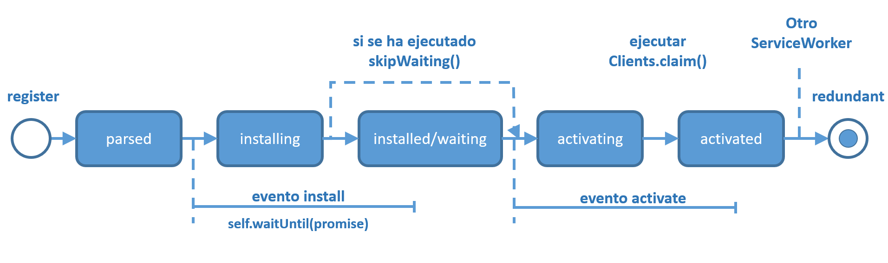
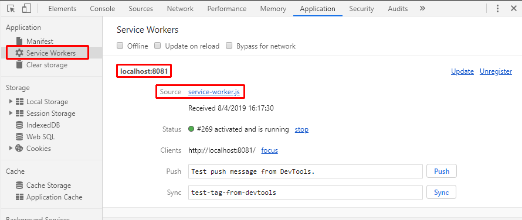

# Service Workers
## Introduccción
Los Service Workers son los elementos más importantes de una PWA y se caracterizan por:
- Posibilidad de interceptar las peticiones fetch lanzadas desde la aplicación.
- Posibilidad de cachear la respuesta de las peticiones fetch interceptadas.
- Se ejecutan de un hilo independiente al hilo principal de ejecución de la aplicación, por lo que no afectan al rendimiento de esta.
- Solamente se pueden ejecutar mediante protocolo **https**, a excepción del caso de *localhost* en el que está permitido tanto *https* como *http*.

## Consideraciones iniciales

- El evento **install** es el primero que obtiene un ServiceWorker y solo sucede una vez para esa vesión del ServiceWorker (hasta que no se modifique el archivo JavaScript en el que está el ServiceWorker, no se volverá a lanzar).
- El método **installEvent.waitUntil()** recibe una promesa como argumento. Esa promesa se resolverá cuando las tareas que se quieran incluir (por ejemplo cachear recursos) en la instalacción hayan terminado correctamente o fracasado. De esa forma el ServiceWorker sabe cuando dar por terminada la instalación.
- Un ServiceWorker no recibirá eventos **fetch** ni **push** hasta haya instalado correctamente y su estado sea **active**.
- Por defecto, los *fetch* de una página no atravesarán un ServiceWorker a menos que la solicitud (del HTML) de la propia página en sí lo haya hecho (a través del service worker). Por lo tanto, se tiene que actualizar la página para ver los efectos del ServiceWorker.
- **clients.claim()** puede anular esta configuración predeterminada y tomar el control de las páginas no supervisadas (aunque no hayan sido cargadas a través del ServiceWorker).
- Por defecto, si no existe un ServiceWorker previo, se pasa directamente desde la instalación a la activación.
- Si existe un Serviceworker previo, el nuevo Serviceworker queda en espera y no puede activarse mientras no se salga de la página y se vuelva a ella o haya pasado un determinado periodo de tiempo. Si se desea forzar que el nuevo ServiceWorker se active, se debe ejecutar **self.skipWaiting()**.



## Registro (parseo) de un Service Worker
Los service worker se declaran en un archivo js separado y en la posición superior del árbol de archivos en la que se quiera que este tenga efecto (si se desea que sea aplicable a toda la aplicación, entonces se debe crear el archivo en el directorio raiz de esta). En el siguiente ejemplo se crea un archivo *service-worker.js* inicialmente vacio. En un \<script> del *index.html* se lanzará el proceso de registro del Service Worker de la siguiente manera.

```javascript
if ('serviceWorker' in navigator) {
  window.addEventListener('DOMContentLoaded', () => {
    navigator.serviceWorker.register('service-worker.js')
    .then(registration => console.log('Service Worker registrado: ', registration))
    .catch(err => console.error('Fallo en el registro:', err));
  });
}
```
Si se consulta la sección *Application* de las *DevTools* del navegador, seleccionando el elemento de *Service Workers*, se puede ver que el Service Worker está activo y en ejecución (aunque de momento no esté ejecutando ningún código porque su js está vacio).



- Si la promesa que retorna el método *register* se rechaza (se ejecuta el catch), entonces significa que o el js no se ha encontrado (404), o su sintaxis era incorrecta o se ha producido una excepción en su ejecución. Por tanto el Service Worker no se habrá instalado (no habrá llegado al estado *installed*).
- Si la promesa que retorna el método *register* se resuelve (se ejecuta el then), entonces significa que el js se ha leido correctamente y justo después se inciará la fase de instalación. Por lo que se lanzará el evento **install** del objeto de la clase ***ServiceWorkerGlobalScope*** (explicada en el apartado siguiente) accesible mediante la variable **self** desde dentro del js del Service Worker.

## interface ServiceWorkerGlobalScope
En el archivo js del Service Worker, se puede acceder mediante la variable ***self*** a un objeto que implemneta la interface **ServiceWorkerGlobalScope** que a su vez permite acceder a las propiedades, métodos y eventos del ServiceWorker que se está ejecutando.
#### Propiedades

| propiedad    | Descripción                                            |
| ------------ | -------------------------------------------------------|
| caches       | Instancia de la clase [CacheStorage](https://developer.mozilla.org/en-US/docs/Web/API/CacheStorage) donde se guardan los elementos cacheados por el Service Worker |
| clients      | Permite obtener información (relacionado con foco y navegación) del window que lo ha instanciado |
| registration | Objeto ServiceWorkerRegistration (el mismo que se obtiene cuando se resuelve la promesa de registro del Service Worker en el script del html principal) |


#### Métodos

| Método        | Descripción                                            |
| ------------- | -------------------------------------------------------|
| skipWaiting() | Permite indicar que el ServiceWorker no quede esperando en el estado **installed** y pase al estado **active**. |
| fetch         | Permite permite al propio Service Worker realizar peticiones http |


#### Eventos

| Evento                 | Descripción                                            |
| ---------------------- | -------------------------------------------------------|
| install                | Cuando el Service Worker entra en el estado **installing** |
| activate               | Cuando el Service Worker entra en el estado **activating**. |
| fetch                  | Cada vez que desde la aplicación monitorizada se lanza un *fetch* |
| message                | Se ejecuta cuando ser recibe un mensaje desde la aplicación, enviado con el método **postMessage**, se puede responder con otro *postMessage* desde **event.data.port** |
| push                   | Cuando se recibe una notificación *push* del servidor. |
| pushsubscriptionchange | Cuando se va a invalidar la suscripción a una notificación push (por ejemplo porque se ha alcanzado el tiempo de expiración) |
## Variables para el ServiceWorkerRegistration
Para trabajar de una forma más cómoda declaramos dos variables para almacenar la versión actual y el nombre del caché donde se almacenarán las peticiones cacheadas de la aplicación. Además se declara un array con los recursos que se cachearán inicialmente.
```javascript
    const version = 'V1';
    const currentCacheName = `MI_CACHE_${version}`;
    const archivosCache = ['/styles/index.css', '/img/mapa2.png'];
```

## Instalación de un Service Worker

La instalación de un Service Worker es la fase en la que se pueden cachear los archivos de la aplicación. El inicio de esta fase viene dado por el estado **installing** y por la ejecución del evento **install**. Para indicar cuando las tareas de instalación han terminado (normalmente, cuando el cacheo ha terminado), se emplea el método **waitUntil** del objeto *event* recibido. Ese método recibirá una promesa como argumento, cuando esa promesa se resuelva, el Service Worker se dará por installado y pasará al estado **installed/waiting**.

En el siguiente ejemplo, la instalación sería instantanea.

```javascript
    self.addEventListener('install', event => {
        event.waitUntil(Promise.resolve(true));
    });
```

Un escenario más real sería si se cachea un conjunto de archivos cuyos nombres se indican en un array.

```javascript
    var archivosCache = ['styles/index.css', 'img/mapa1.jpg'];
    self.addEventListener('install', event => {
        console.log('EVENTO: install', self.registration.installing.state, version);
        // Permitir que esta versión del ServiceWorker se active inmediatamente aunque haya otra versión cargada.
        self.skipWaiting();
        event.waitUntil(
            caches.open(currentCacheName).then(function(cache) {
                return cache.addAll(archivosCache);
            })
        );
    });
```

Nota: recuerdese, que si la función pasada a un método *then* retorna un valor, entonces el método *then* retorna una nueva promesa que resuelve con dicho valor (concatenación de promesas).

Para más detalle sobre el cacheo, consultar el tema [Caché API](../../cache/README.md).

## Activación de un Service Worker

Una vez un Service Worker se ha instalado puede pasar a activarse siempre que no quede otro Service Worker (u otra versión del mismo), actuando sobre su mismo ambito (es decir, actuando sobre los mismos clientes). Los **clientes** son páginas, Workers o Workers compartidos cuyas peticiones *fetch* están siendo controladas por un Service Worker.

Hasta que la página no se haya cargado desde el principio con un ServiceWorker ya activo, el control (captura de las peticiones *fetch*) no tendrá lugar. Por lo que, en la primera carga, las peticiones se hacen directamente desde la página y no pasan por el Service Worker. Si el Service Worker no modifica los datos retornados en los fetch, entonces esto no es problema.

## Toma del control de los clientes

Si se desea que el Service Worker tenga el control de los clientes de su ambito, se debe ejecutar la siguientes instrucción en el evento **activate**:
```javascript
    self.addEventListener('activate', event => {
        console.log('EVENTO: activate ', self.registration.active.state, version);
        // Permite que todas las pestañas, no necesiten recargarse para recibir esta versión.
        self.clients.claim();
    });
```
El uso de **self.clients.claim()** tiene dos posibles aplicaciones:
- Que el Service Worker tenga el control desde el principio (una vez que se ha activado el Service Worker), incluso aunque sea la primera vez que se carga la página.
- Si se ha instalado una actualización, que el nuevo Service Worker tome el control de todos los clientes del ambito.

## Instalación de nuevas de versiones del Service Workers
Una nueva versión del código del Service Worker (de su archivo js), por defecto, solamente intentará instalarse (y cuando pueda activarse) si se cumple alguna de las siguientes condiciones:

- Navegación a otra página dentro del scope del Service Worker.
- Durante eventos push o sync (si no se ha actualizado ya en las útimas 24h).
- Si se llama a *register* pasandole una nueva URL del código del Service Worker (no recomendado).

## Actualización manual a una nueva versión del Service Worker
Desde el código de la apicación, se puede iniciar el proceso de lectura de una nueva versión del código del js del Service Worker mediante el método **update** del objeto **register**. Este método descarga de nuevo el js y lo compara con el que tiene en ejecución el Service Worker.

```javascript
    navigator.serviceWorker.register('service-worker.js').then(registration => {
        registration.update();
    });
```

## Omisión de la espera de activación
Si una nueva versión del código de un Service Worker supera la fase de instalación, por defecto, no pasará a activo si hay una versión anterior del Service Worker en ejecución. En ese caso, quedará en el estado *installed/waiting*. Si se desea desbloquear esto automáticamente, se deberá ejecutar en el evento **install** (preferiblemente al principio) el método **skipWaiting**:
```javascript
    self.skipWaiting();
```
## Eliminación de cachés antiguos
Tras la instalación (con el cacheo de nuevos recursos) llevada a cabo en el evento *install*, se pueden borrar los archivos cacheados que ya no van a ser empleados. Para ello se puede emplear en el evento **activate** el método **waitUntil** para no terminar la activación hasta que no se hayan borrado todos los caches obsoletos. A continuación se muestra un ejemplo de como podría hacerse esto.

```javascript
    self.addEventListener('activate', event => {
        event.waitUntil(
            caches.keys().then(keys => Promise.all(
                keys.map(key => {
                    if (!archivosCache.includes(key)) {
                      return caches.delete(key);
                    }
                })
            )).then(() => {
                self.clients.claim();
                console.log('La versión 2 está lista para recibir peticiones (fetch)');
            })
        );
    });
```
**Nota**: durante el waitUntil los fetch de los clientes quedan en un buffer hasta que termine la activación.

Para más detalle sobre el cacheo, consultar el tema [Caché API](../../cache/README.md).

## Código del ejemplo

A continuación se muestra cómo podría ser el ejemplo completo que se ha ido trabajando en este tema.
El HTML del index.html podría ser el siguiente:

```html
    <body>
      <script>
          window.addEventListener('DOMContentLoaded', () => {
              if ('serviceWorker' in navigator) {
                  navigator.serviceWorker.register('service-worker.js').then((registration) => {
                      registration.update(); // Descarga y comprueba si hay una nueva versión del JS
                  }).catch(err => console.error('Fallo en el registro:', err));
              }
              document.getElementById('boton').addEventListener('click',(event) => {
                  var img = new Image();
                  img.src = 'img/mapa1.jpg'
                  img.style.width = '25vw';
                  document.body.appendChild(img);
              });
          });
      </script>
      <h2>Imágenes</h2>
      <div>
          <button id="boton" type="button" >Pedir imagen</button>
      </div>
    </body>
```

Y el código del Service Worker (archivo service-worker.js):

```javascript
    const version = 'V1'
    const currentCacheName = `MI_CACHE_${version}`;
    const archivosCache = ['/styles/index.css', '/img/mapa2.png'];

    self.addEventListener('install', event => {
        console.log('EVENTO: install', self.registration.installing.state, version);
        // Permitir que esta versión del ServiceWorker se active inmediatamente aunque haya otra versión cargada.
        self.skipWaiting();
        event.waitUntil(
            caches.open(currentCacheName).then(function(cache) {
                return cache.addAll(archivosCache);
            })
        );
    });

    self.addEventListener('activate', event => {
        console.log('EVENTO: activate ', self.registration.active.state, version);
        // Permite que todas las pestañas, no necesiten recargarse para recibir esta versión.
        self.clients.claim();
    });

    self.addEventListener('fetch', event => {
        // Ver apartado de caché para un tratamiento más completo
        const url = new URL(event.request.url);
        console.log('EVENTO: fetch', url.pathname, version);
        if (url.origin == location.origin && url.pathname == '/img/mapa1.jpg') {
            // 1.- a respondWidth se le debe pasar una promesa que resuelva
            // con un objeto Response.
            // 2.- caches.match(request:Request|string) retorna una promesa que resuelve en un
            // objeto Response está guardado en el caché o undefined si no lo está.
            event.respondWith(caches.match('/img/mapa2.png'));
        }
    });

    console.log('ServiceWorker leido', version);
```

## Reflexiones
- Si no se indica **self.skipWaiting()** mientras haya abierta una ventana/pestaña con una versión anterior del ServiceWorker, la versión actual no se activara (y por lo tanto esta nueva versión no podrá capturar peticiones fetch).
- Si no se ejecuta **self.clients.claim()**, las pestañas actualmente abiertas, hasta que no se recarguen, no podrán ser supervisadas por la versión alctual del ServiceWorker.

## Especificar el scope de un ServiceWorker
El método **register** para registrar un serviceworker tiene un segundo parámetro que recibe un objeto de configuración. En la propiedad **scope** de ese objeto, se puede indicar el ambito en el que actuará dicho service worker, de modo que dicho ambito no vendrá no vendrá dado por la ubicación del JS del ServiceWorker.

```javascript
    navigator.serviceWorker.register('service-worker.js', {
      scope: './controlled'
    });
```


[Volver al índice de temas](../../README.md)
