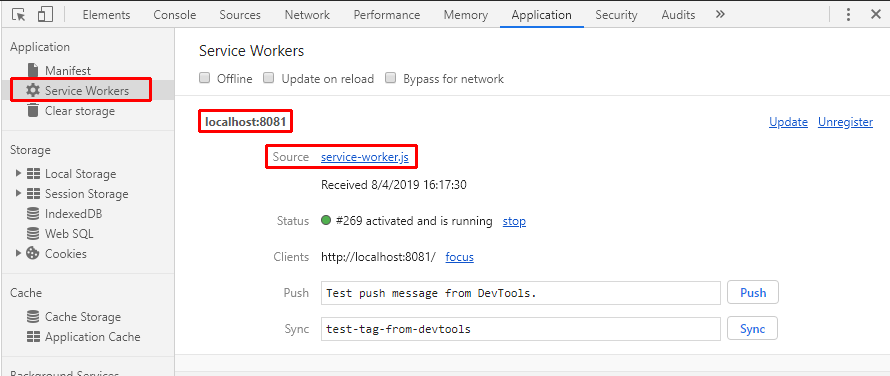

# PWA
## Introduccción
Los Service Workers son los elementos más importantes de una PWA y se caracterizan por:
- Posibilidad de interceptar las peticiones fetch lanzadas desde la aplicación.
- Posibilidad de cachear la respuesta de las peticiones fetch interceptadas.
- Se ejecutan de un hilo independiente al hilo principal de ejecución de la aplicación, por lo que no afectan al rendimiento de esta.
- Solamente se pueden ejecutar mediante protocolo **https**, a excepción del caso de *localhost* en el que está permitido tanto *https* como *http*.

## Registro de un Service Worker
Los service worker se declaran en un archivo js separado y en el lugar del árbol de archivos superior de la rama en la que se quiera que este tenga efecto (si se desea que sea aplicable a toda la aplicación, entonces se debe crear el archivo en el directorio raiz de esta). En el siguiente ejemplo se crea un archivo *service-worker.js* inicialmente vacio. En un script del *index.html* se lanzará el proceso de registro del Service Worker de la siguiente manera.

```javascript
if ('serviceWorker' in navigator) {
  window.addEventListener('load', () => {
    navigator.serviceWorker.register('service-worker.js')
    .then(registration => console.log('Service Worker registrado: ', registration))
    .catch(err => console.error('Fallo en el registro:', err));
  });
}
```
Si se consulta la sección *Application* de las DevTools del navegador, seleccionando el elemento de *Service Workers*, se puede ver que el Service Worker está activo y en ejecución (aunque de momento no esté ejecutando ningún código porque su js está vacio).


## clase ServiceWorkerGlobalScope
En el archivo js del Service Worker, se puede acceder mediante la variable ***self*** a un objeto de la clase **ServiceWorkerGlobalScope** que a su vez permite acceder a las propiedades, métodos i eventos del ServiceWorker que se está ejecutando.
#### Propiedades

| propiedad    | Descripción                                            |
| ------------ | -------------------------------------------------------|
| caches       | Instancia de la clase [CacheStorage](https://developer.mozilla.org/en-US/docs/Web/API/CacheStorage) donde se guardan los elementos cacheados por el Service Worker |
| clients      | Permite obtener información (relacionado con foco y navegación) del window que lo ha instanciado |
| registration | Permite obtener información del estado de registro del Service Worker |

#### Métodos

| Métodos       | Descripción                                            |
| ------------- | -------------------------------------------------------|
| skipWaiting() | Permite que el ServiceWorker no quede esperando en el estado **installed** y pase al estado **active**. |
| fetch         | Permite permite al propio Service Worker realizar peticiones http |

#### Eventos

| Eventos                | Descripción                                            |
| ---------------------- | -------------------------------------------------------|
| install                | Cuando el Service Worker entra en el estado **installing** |
| activate               | Cuando el Service Worker entra en el estado **active**. |
| fetch                  | Cada vez que desde la aplicación monitorizada se lanza un *fetch* |
| message                | Se ejecuta cuando ser recibe un mensaje desde la aplicación, enviado con el método **postMessage**, se puede responder con otro *postMessage* desde **event.data.port** |
| push                   | Cuando se recibe una notificación *push* del servidor. |
| pushsubscriptionchange | Cuando se va invalidar la suscripción a una notificación push (por ejemplo porque se ha alcanzado el tiempo de expiración) |


Imagen obtenida de [bitsofco.de](https://bitsofco.de/the-service-worker-lifecycle/)
