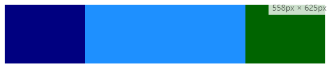

# Responsive Web Design (RDW)
## Curso recomendado (gratuito)
[Udacity - Responsive Web Design Fundamentals](https://www.udacity.com/course/responsive-web-design-fundamentals--ud893)

## Viewport, hardware width, device independent width

<meta name="viewport" content="width=device-width, initial-scale=1"/>

Se recomienda establecer por defecto un ancho máximo a todas las imagenes y videos del 100% de su contenedor de modo que si el viewport está establecido al ancho del dispositivo, dichas imagenes y vídeos no se saldrán del viewport.
```css
    img, video {
        max-width: 100%;
    }
```
## Consideraciones de diseño
Para aplicaciones en las que se usen dispositivos táctiles, el tamaño minimo de los botones debe ser de 48px x 48px y el espacio mínimo entre botones de 40px.

## Layout

### Patrón Column Drop
Con este patrón se pretende pasar de una distribución de cajas apiladas para los dispositivos más pequeños (mobile-first).
<p style="text-align: center;">

</p>
Y posteriormente para tamaños mayores ir poniendo las cajas en columnas segun se vayan pudiendo incluir.
<p style="text-align: center;">

</p>
Hasta llegar a que todas las cajas estén distribuidas en una única fila.
<p style="text-align: center;">

</p>
Estructura contenedor/bloques:
```html
    <div class="container">
        <div class="box dark_blue"></div>
        <div class="box light_blue"></div>
        <div class="box green"></div>
    </div>
```
Estilos comunes y mobile-first:
```css
    /* COMMON STYLES FOR LAYOUTS */
    .container {
        display: flex;
        flex-wrap: wrap;
    }
    .box {
        width: 100%;
        height: 100px;
    }
    .dark_blue {background-color: navy;}
    .light_blue {background-color: dodgerblue;}
    .green {background-color: darkgreen;}
```
Cortes para dispositivos más anchos:
```css
    /* COLUMN DROP LAYOUT PATTERN */
    @media screen and (min-width: 450px) {
        .dark_blue {width: 25%;}
        .light_blue {width: 75%;}
    }
    @media screen and (min-width: 550px) {
        .dark_blue {width: 25%;}
        .light_blue {width: 50%;}
        .green {width: 25%;}
    }
```
