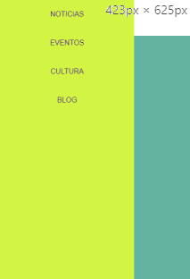

# Responsive Web Design (RDW)
## Curso recomendado (gratuito)

[Udacity - Responsive Web Design Fundamentals](https://www.udacity.com/course/responsive-web-design-fundamentals--ud893)

## Viewport, hardware width, device independent width

<meta name="viewport" content="width=device-width, initial-scale=1"/>

Se recomienda establecer por defecto un ancho máximo a todas las imagenes y videos del 100% de su contenedor de modo que si el viewport está establecido al ancho del dispositivo, dichas imagenes y vídeos no se saldrán del viewport.
```css
    img, video {
        max-width: 100%;
    }
```
## Consideraciones de diseño
Para aplicaciones en las que se usen dispositivos táctiles, el tamaño minimo de los botones debe ser de 48px x 48px y el espacio mínimo entre botones de 40px.

## Layout

### Reset de elementos
 A continuación se expone un reset básico de los elementos css, para obtener un más detallado visitar la propuesta del guro CSS [Eric Meyer](https://meyerweb.com/eric/tools/css/reset/). Con esto se evita la no homogeneidad de los valores por defecto de los navegadores.

```css
    body,  html { margin: 0; padding: 0; width: 100%; height: 100%;	}
    body{line-height: 1;}
    * { box-sizing: border-box; margin: 0;padding: 0;}
    footer, header, hgroup, menu, nav, section { display: block;}
    ol, ul { list-style: none;}
    table {	border-collapse: collapse;border-spacing: 0;}
```

### Patrón Column Drop
Con este patrón se pretende pasar de una distribución de cajas apiladas para los dispositivos más pequeños (mobile-first).


Y posteriormente para tamaños mayores ir poniendo las cajas en columnas segun se vayan pudiendo incluir.


Hasta llegar a que todas las cajas estén distribuidas en una única fila.


Estructura contenedor/bloques:
```html
    <div class="container">
        <div class="box dark_blue"></div>
        <div class="box light_blue"></div>
        <div class="box green"></div>
    </div>
```
Estilos comunes y mobile-first:
```css
    /* COMMON STYLES FOR LAYOUTS */
    .container {
        display: flex;
        flex-wrap: wrap;
    }
    .box {
        width: 100%;
        height: 100px;
    }
    .dark_blue {background-color: navy;}
    .light_blue {background-color: dodgerblue;}
    .green {background-color: darkgreen;}
```
Cortes para dispositivos más anchos:
```css
    /* COLUMN DROP LAYOUT PATTERN */
    @media screen and (min-width: 450px) {
        .dark_blue {width: 25%;}
        .light_blue {width: 75%;}
    }
    @media screen and (min-width: 550px) {
        .dark_blue {width: 25%;}
        .light_blue {width: 50%;}
        .green {width: 25%;}
    }
```
### Patrón Mostly fluid
Es una variante del caso anterior en el que van subiendo las cajas formando filas con diferentes distribuciónes. Se estructura también como un conjunto de div dentro de un container y mediante el porcentaje de sus anchos se van incluyendo en las correspondientes filas según el corte de la media query correspondiente.


Para el último corte se fija el ancho del contendor y se le aplican margenes automáticos (para centralo).
```css
    /* ULTIMO CORTE DE MEDIA QUERY, SE FIJA EL ANCHO DEL CONTAINER */
    @media screen and (min-width: 550px) {
    .container {
        width: 960px;
        margin-left: auto;
        margin-right: auto;
    }
```
### Patrón Layout Shifter
Este patrón según va creciendo el tamaño de la pantalla va moviendo las cajas, pero de una forma más compleja:
- Contenedores anidados: puede haber dos cajas una encima de otra compartiendo fila con otra que tiene toda la altura.
- El orden de las cajas puede cambiar: mediante el uso de la propiedad order de los elementos de un flexbox, se puede cambiar la posición en la que aparecen según el tamaño del dispositivo.
En este ejemplo se parte de una distribución de una sola columna acorde con mobile-first.


Tras el primer corte se ve como una fila tiene en una de sus columnas dos subfilas.


En el último tramo (no necesariamente en el último tramo) se han intercambiado posiciones de elementos (azul oscuro y rojo).


Para llevar a cabo este ejemplo se crea un contendor grupado cuyos elementos estarán dentro de dicho contenedor siempre en una sola columna, pues dichos elementos siempre tienen un ancho del 100%.
```html
    <div class="container">
        <div class="box dark_blue"></div>
        <div class="container" id="container2">
            <div class="box light_blue"></div>
            <div class="box green"></div>
        </div>
        <div class="box red"></div>
    </div>
```
En los estilos comunes y mobile-first, se ha cambiado la altura (*height*) de los box por altura minima (***min-height***) y se indica que los elementos se expandan para ocupar toda la altura de la fila (mediante la propiedad de elementos flexbox ***align-items: stretch***):
```css
    /* COMMON STYLES FOR LAYOUTS */
    .container {
        width: 100%;
        display: flex;
        flex-wrap: wrap;
        align-items: stretch;
    }
    .box {
        width: 100%;
        min-height: 100px;
    }
    .dark_blue {background-color: navy;}
    .light_blue {background-color: dodgerblue;}
    .green {background-color: darkgreen;}
    .red {background-color: red;}
```
En el primer corte se reparten la primera fila el bloque azul oscuro y el contenedor2 (que tiene sus cajas interiores apiladas):
```css
    /* EL PRIMER BLOQUE Y EL CONTAINER 2 SE REPARTEN LA PRIMEREA FILA */
    @media screen and (min-width: 500px) {
        .dark_blue {width: 50%;}
        #container2 {width: 50%;}
    }
```
En el segundo corte se intercambian las posiciones del primer y último elemento.:
```css
    /* EL PRIMER y ULTIMO BLOQUE SE INTERCAMBIAN */
    @media screen and (min-width: 650px) {
        .dark_blue {
            width: 25%;
            order: 1;
         }
        .red {
            width: 25%;
            order: -1;
        }
    }
```
### Patrón Off Canvas
Este patrón muestra el menú en la parte superior de la página para resoluciones grandes y para resoluciones pequeñas tiene el menú oculto (fuera del viewport) en el lado derecho (por ejemplo) y al pulsar el botón con tres rallas (popularmente llamado hamburguesa) dicho menú entra en el viewport para que el usuario seleccione una opción.

 ---> 


A continuación se muestra el html de una cabecera (header) de la página con el icono de menú, el título de la página y el menú (etiqueta nav y su contenido)
```html
        <header class="header">
            <a id="openner" href="#">
                
            </a>
            <h1 class="header__title"> Off canvas</h1>
            <nav class="nav">
              <ul class="nav__list">
                <li class="nav__item"><a href="#">NOTICIAS</a></li>
                <li class="nav__item"><a href="#">EVENTOS</a></li>
                <li class="nav__item"><a href="#">CULTURA</a></li>
                <li class="nav__item"><a href="#">BLOG</a></li>
              </ul>
            </nav>
        </header>
```
En los estilos por defecto (mobile-first) es decir para resoluciones pequeñas, se configura el menú fuera del viewport, para ello se establece un posicionamieto absoluto con ubicado en la posición 0,0 de la página (o de la cabecera, si esta tuviera posicionamiento relativo). El efecto de que el menú esté oculto se consigue aplicandole una transformació de translación de 300px a su izquierda lo que sumado a que el ancho del menú es de 300px, este queda oculto (por estár fuera del view port)
```css
    h1 {
        font-size: 2.5em;
        margin: 0.5em 0.25em;
        display: inline-block;
    }
    header { background-color: white;}
    .nav {
        width: 300px;
        height: 100%;
        position: absolute;
        top: 0px;
        transform: translate(-300px, 0);
        transition: transform 0.3s ease;
        background-color: #d1f542;
    }
    nav.open { transform: translate(0, 0);}
    .nav__item {
        width: 100%;
        text-align: center;
        padding: 1.5em;
    }
    .nav a {  text-decoration: none;}
    .nav a:hover { font-weight: bolder;}
```
Para que el menú se muestre, al pulsar el hipervínculo de id="openner" (con el icono de menú), mediante el siguiente código JavaScript, se aplicará la clase de estilo "open" al menú (etiqueta nav), lo que hará que la transformación de translación pase a ser 0 en lugar de -300 y que por lo tanto el menú quede dentro del viewport (y por lo tanto visible).
```javascript
    window.onload = (ev) => {
          document.getElementById('openner').onclick = (ev) => {
              document.querySelector('nav').classList.toggle('open');
          }
          document.querySelector('nav').onclick = (ev) => {
              document.querySelector('nav').classList.toggle('open');
          }
    }
```
Del mismo modo, se ha aplicado sobre el menú en su evento click la eliminación de la clase de estilo "open" para que el menú vuelva a estar oculto.

Para las resoluciones mayores (en este caso a partir de 450px), el menú será visible siempre en la parte superior de la pantalla.


Para ello se quita el posicionamiento absoluto del menú (etiqueta nav), se oculta el icono de menú y los elementos del menú se muestran en modo flexbox con distribución horizontal.
```css
@media screen and (min-width: 450px) {
    .nav {
        width: 100%;
        transform: translate(0, 0);
        position: relative;
    }
    #openner { display: none;}
    .nav__list {
        width: 100%;
        display: flex;
    }
    .nav__item { width: 25%; }
}
```

### Patrón Tiny Tweeks
No es un patrón de layout sino un patrón de ajuste de los tamaños de los elementos tamaño de texto e imágenes. A continuación se muestra un ejemplo de una sola columna cuyo tamaño de texto va aumentando con el tamaño del dispositivo.
```css
    /* COMMON STYLES */
    *{box-sizing: border-box; font-family: sans-serif;}
    .container {
        width: 100%;
        padding: 10px;
        background-color: khaki;
        text-align: justify;
    }
    /* EL PRIMER CORTE DE INCREMENTO DE TAMAÑO DE TEXTO */
    @media screen and (min-width: 600px) {
        .container {
            padding: 20px;
            font-size: 1.5em;
        }
    }
    /* SEGUNDO CORTE DE INCREMENTO DE TAMAÑO DE TEXTO */
    @media screen and (min-width: 800px) {
        .container {
            padding: 40px;
            font-size: 2em;
        }
    }
```
